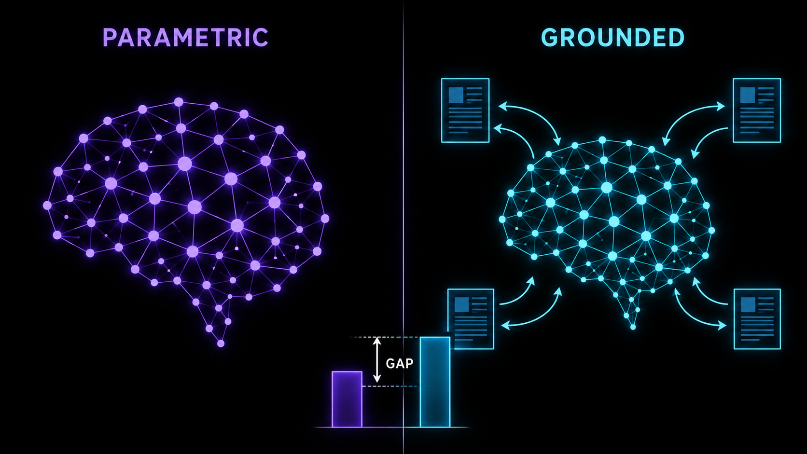
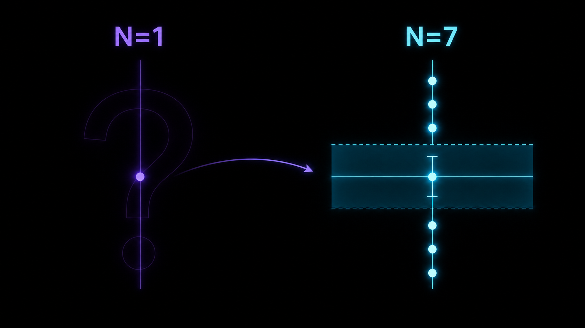
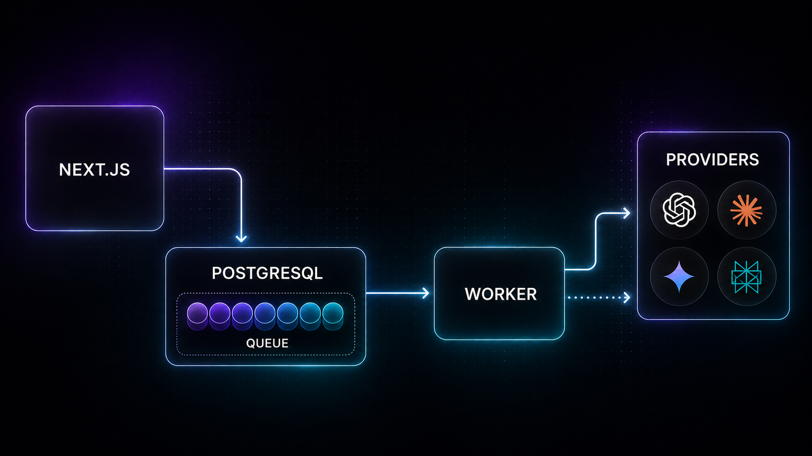

# Generative Engine Monitor

Mesure la visibilité d'une marque à l'intérieur des réponses des moteurs génératifs : médianes et intervalles de confiance, scores décomposés règle par règle, analyses rejouables sans rappeler une seule API.


Une part croissante de la découverte de marque ne passe plus par une page de résultats mais par une réponse rédigée : l'utilisateur pose sa question à ChatGPT, Claude, Gemini ou Perplexity, lit un paragraphe, et n'ouvre souvent aucun lien. Mesurer sa présence dans ces réponses n'est pas la même discipline que mesurer un classement. Il n'y a pas de position 3 stable à surveiller : il y a une distribution de réponses, dont chaque tirage nomme des marques dans un ordre différent, s'appuie ou non sur des sources, et change selon que le moteur consulte le web ou récite ce qu'il a appris. Un outil qui ramène tout cela à un chiffre unique par requête mesure surtout son propre bruit d'échantillonnage.

## Ce que cet outil fait différemment

### Deux axes, jamais mélangés



Chaque requête est posée deux fois : en mode **PARAMETRIC**, tous les outils de recherche désactivés — ce que le modèle a retenu de son entraînement — et en mode **GROUNDED**, la recherche web native du fournisseur activée — ce qu'il va chercher au moment de répondre. Les deux médianes sont rapportées côte à côte et jamais moyennées, car leur différence est l'unique diagnostic actionnable qu'elles portent ensemble. Un **écart de récupération** positif signifie que la recherche vous sert et que l'investissement utile est le contenu que les moteurs iront chercher ; un écart négatif signifie que les modèles vous connaissent mais cessent de vous citer dès qu'ils consultent leurs sources, et l'investissement utile devient ces sources-là.

### Des intervalles, jamais un chiffre sec



Deux appels identiques au même modèle ne produisent pas la même réponse : la marque citée en premier dans un tirage peut être absente du suivant. Chaque cellule (requête × moteur × mode) est donc échantillonnée N fois — trois par défaut — et rapportée comme une **médiane**, un **intervalle de confiance bootstrap percentile** sur cette médiane, et un **indicateur de stabilité** dérivé de la MAD, insensible à un tirage aberrant isolé. Le tirage bootstrap part d'un PRNG initialisé par une graine persistée, si bien qu'un même run relu deux fois rend le même intervalle au bit près : « l'intervalle a bougé » et « la marque a bougé » restent deux constats distincts. En dessous du seuil de `lowN`, l'interface affiche une bande directionnelle plutôt qu'un chiffre — un échantillon unique mesure essentiellement le bruit.

### Des scores explicables et rejouables

Un score n'est jamais un nombre opaque : il est la somme signée de contributions par règle, chacune accompagnée de l'évidence qui l'a déclenchée — décalages de caractères dans la réponse, URL des citations retenues, verdict de sentiment majoritaire. Cette décomposition est persistée telle qu'elle a été calculée, puis rendue telle qu'elle a été persistée. Comme le texte brut et la charge utile JSON de chaque réponse sont stockés intégralement, n'importe quelle analyse passée peut être **rejouée** sous une version de scoring ou d'extraction différente, à coût API nul : le replay passe par la même file de jobs qu'un run réel, avec sa progression, ses reprises et son annulation.

## Architecture



L'application Next.js ne fait jamais d'appel fournisseur dans le cycle d'une requête HTTP. Lancer une analyse **matérialise le plan entier** — un `Run`, ses `RunTask` (une par cellule), ses `RunSample` (un par appel payant) et les jobs correspondants — dans une seule transaction PostgreSQL, puis répond `202`. L'exécution appartient à un ou plusieurs processus **worker** séparés qui drainent une file durable adossée à Postgres : réclamation par `SELECT … FOR UPDATE SKIP LOCKED` (des workers concurrents prennent des lots disjoints sans se bloquer), bail à heartbeat (un worker tué rend ses jobs au balayeur au lieu de les immobiliser), seau à jetons partagé en base (la limite qui compte est celle du fournisseur, pas celle d'un conteneur). La progression est portée par des compteurs décrémentés dans la transaction qui écrit le résultat : `pendingSamples` à zéro déclenche l'agrégation de la tâche, `pendingTasks` à zéro celle du run. Rien ne fait de polling, et le conteneur web peut redémarrer en plein run sans perdre de travail.

## Démarrage rapide

### Docker Compose

```bash
cp .env.example .env
npm install             # `keygen` s'exécute par tsx, livré avec les dépendances
npm run keygen          # génère NEXTAUTH_SECRET, CREDENTIAL_KEYS et le pepper — à coller dans .env
docker compose up
```

Trois services démarrent : PostgreSQL, l'application web sur http://localhost:3000, et le worker. Le worker est un service à part entière : sans lui les analyses sont planifiées mais n'avancent pas.

### Local

Prérequis : Node ≥ 20.11 et PostgreSQL 16.

```bash
./setup.sh              # crée .env, installe les dépendances, génère les secrets, s'arrête
#                         pointez alors DATABASE_URL sur votre instance dans ce .env
./setup.sh              # client Prisma, migrations, seed
npm run dev             # application web
npm run worker          # exécuteur d'analyses, dans un second terminal
```

`setup.sh` ne génère les secrets que lorsqu'il crée lui-même le `.env` : le copier à la main avant de l'appeler saute cette étape et laisse en place la clé de chiffrement d'exemple.

Le moteur **`mock`** ne demande aucune clé API : il produit des réponses de fixture réalistes dans les deux modes, avec mentions et sources. Toute la chaîne — planification, file, exécution, extraction, scoring, agrégation, intervalles, replay, export — se démontre donc de bout en bout sans dépenser un centime, avant même d'avoir saisi une clé. Il n'est planifié **que tant qu'aucune clé valide n'existe** : ses réponses sont des fixtures, et l'agrégation ne distingue pas leur origine, si bien que les planifier à côté d'un vrai moteur reviendrait à publier une médiane et un intervalle de confiance qu'aucun fournisseur n'a produits.

Ses fixtures nomment un panel fixe d'éditeurs CRM. Pour voir un tableau de bord peuplé, partez du projet de démonstration créé par `SEED_DEMO=true`, dont la marque suivie fait partie de ce panel : un projet dont la marque n'y figure pas produira légitimement des scores nuls, ce qui se lit comme une installation cassée alors que la mesure est exacte. Dès qu'une vraie clé API est configurée, la question ne se pose plus.

## Moteurs supportés

| Code | Libellé | Paramétrique | Groundé | Origine des citations | Variable de modèle |
|---|---|---|---|---|---|
| `openai` | OpenAI ChatGPT | oui | oui | annotations `url_citation` de l'API Responses (NATIVE), complétées par les URL trouvées dans le texte | `OPENAI_MODEL` |
| `claude` | Anthropic Claude | oui | oui | blocs `web_search_tool_result` et citations `web_search_result_location` (NATIVE), complétés par les URL du texte | `ANTHROPIC_MODEL` |
| `gemini` | Google Gemini | oui | oui | `groundingMetadata.groundingChunks` (NATIVE), complétés par les URL du texte | `GEMINI_MODEL` |
| `perplexity` | Perplexity | non | oui | `search_results` (NATIVE), avec repli sur `citations` quand le champ est absent | `PERPLEXITY_MODEL` |
| `mock` | Mock (démo) | oui | oui | sources de fixture, marquées NATIVE en mode groundé | aucune |

Perplexity interroge toujours le web : le mode paramétrique n'a pas de sens pour ce moteur, et la planification saute la cellule au lieu de la faire échouer. Les citations issues des métadonnées natives (`NATIVE`) sont distinguées de celles simplement écrites dans la réponse (`INLINE_MARKDOWN`, `BARE_URL`) : un lien tapé de mémoire n'est pas la preuve qu'un document a été récupéré. L'origine est portée par chaque citation, tranche les collisions après normalisation en faveur de la source native, et reste lisible dans le détail d'un échantillon. Ce que la règle `citation` en fait dépend de la version de scoring : `v2` compte toutes les sources retenues, `v3` — la version courante — ne crédite que celles que le fournisseur a réellement renvoyées. Le changement de barème a pris la forme d'un nouveau fichier de version enregistré dans le registre, jamais d'une retouche du précédent : c'est ce qui laisse un score persisté sous `v2` reproductible sous `v2`.

**Les identifiants de modèle sont de la configuration, jamais du code.** Chaque fournisseur retire ses modèles à son propre rythme, et un identifiant codé en dur devient une panne silencieuse le jour où il est retiré. Les valeurs par défaut vivent dans [`.env.example`](.env.example), sont surchargeables par variable d'environnement, et le worker journalise les modèles résolus à son démarrage.

## Le modèle de score

Le score d'un échantillon vaut 0 à 100 et se lit comme la somme de ses règles.

| Règle | Poids | Ce qu'elle mesure |
|---|---|---|
| `presence` | 35 | la marque apparaît, pondérée par la qualité de la correspondance (exacte, alias, domaine, approximative) |
| `prominence` | 15 | position de la première mention dans le texte et rang d'apparition parmi toutes les entités |
| `frequency` | 10 | nombre d'occurrences, saturé logarithmiquement |
| `shareOfVoice` | 20 | occurrences de la marque contre celles des concurrents, lissées |
| `citation` | 15 | sources du domaine de la marque parmi celles retenues, ou parmi les seules sources natives selon la version de scoring |
| `sentiment` | signé, plancher −10 | tonalité majoritaire des passages citant la marque |
| `competitorLead` | signé, plancher −8 | concurrents nommés avant la marque, rapportés au nombre de concurrents mentionnés |

La règle `citation` a besoin que quelque chose ait été récupéré. En mode paramétrique, rien ne l'est par construction ; en mode groundé, une réponse sans aucune source renseigne sur le fournisseur, pas sur la marque. Lui attribuer 0 sur 15 dans ces deux cas plafonnerait mécaniquement l'axe paramétrique à 85 et rendrait les deux axes incomparables — l'écart de récupération ne mesurerait plus qu'un artefact de barème. Le budget de la règle est donc **redistribué** aux quatre règles positives qui restent applicables (`presence`, `prominence`, `frequency`, `shareOfVoice`), au prorata de leurs poids : chacune est multipliée par 95/80, et la contribution porte le drapeau `redistributed` pour que la décomposition reste lisible. Les deux axes s'expriment ainsi sur la même échelle et leur différence garde un sens.

Une version de scoring publiée n'est jamais modifiée : tout changement de comportement est un nouveau fichier de version. C'est la seule garantie qui rend un score persisté reproductible, et donc un replay comparable.

## Sécurité

- Les clés API des fournisseurs sont **chiffrées au repos en AES-256-GCM**, avec la paire propriétaire `(userId, providerId)` authentifiée en AAD : un chiffré recopié sur la ligne d'un autre utilisateur échoue au déchiffrement au lieu de lui livrer une clé payante.
- **Rotation par version** : chaque ligne enregistre la version de clé qui l'a écrite et le déchiffrement cherche cette version-là. Ajouter une version et déplacer `CREDENTIAL_KEY_CURRENT` suffit ; les lignes existantes restent lisibles.
- **Aucune route ne renvoie une clé en clair** — les réponses ne portent qu'un masque à quatre caractères et une empreinte HMAC poivrée sert à reconnaître un doublon sans rien déchiffrer.
- **Contrôle de propriété sur chaque route** : toute ressource de projet passe par un helper unique qui vérifie la session puis l'appartenance, et les identifiants enfants sont recherchés avec leur `projectId` pour qu'un identifiant valide d'un autre projet reste introuvable.
- **Limitation de débit** sur l'inscription, sur le lancement d'analyses et sur chaque fournisseur, via un seau à jetons persisté en base et donc partagé entre tous les processus. L'inscription est bornée deux fois : un seau global, débité en premier, et un seau par adresse qui n'existe que si `TRUSTED_PROXY_HOPS` rend l'adresse connaissable — un client capable d'écrire son propre `X-Forwarded-For` se frapperait sinon un seau neuf à chaque requête.
- **CSP stricte et en-têtes de sécurité** : la politique est émise par requête depuis `src/proxy.ts`, avec un nonce et `strict-dynamic` — sans nonce, le bootstrap inline du App Router serait refusé et les pages resteraient non hydratées. `default-src 'self'`, `connect-src 'self'` (le navigateur ne parle jamais à une API fournisseur), `frame-ancestors 'none'`, `object-src 'none'`. Les en-têtes indépendants de la requête — `nosniff`, `X-Frame-Options`, `Referrer-Policy`, HSTS en production — viennent de `next.config.mjs`.
- **Injection de formule neutralisée à l'export CSV** : les noms de concurrents et les URL viennent de sorties de modèles, et toute cellule commençant par `=`, `+`, `-`, `@`, une tabulation ou un retour chariot est désamorcée avant d'être citée.
- L'application **refuse de démarrer en production** avec les secrets d'exemple.

Détail du modèle de menace et procédure de signalement : [SECURITY.md](SECURITY.md).

## Stack

Next.js 16 (App Router) · React 19 · TypeScript strict · PostgreSQL 16 · Prisma 5 · NextAuth 4 · Tailwind CSS · Recharts · Vitest · Docker Compose. Aucune dépendance de file d'attente externe : la durabilité vient de Postgres.

## Arborescence

```
src/
  app/(auth)/        pages de connexion et d'inscription
  app/(dashboard)/   vues projet : synthèse, requêtes, sources, analyses, configuration
  app/api/           routes REST, une par ressource
  components/        primitives d'interface et composants de restitution des scores
  lib/api/           authentification, contrôle de propriété, validation, forme des erreurs
  lib/crypto/        chiffrement enveloppe des clés fournisseurs
  lib/parsing/       versions d'extraction : mentions, offsets, citations, normalisation d'URL
  lib/providers/     contrat AIProvider et une implémentation par moteur
  lib/queue/         file durable, seau à jetons, balayeur de reprise
  lib/runs/          planification d'un run, extraction et scoring d'un échantillon
  lib/scoring/       versions de scoring, statistiques, agrégation, replay
  lib/sentiment/     juge de sentiment adressé par contenu
  types/             contrat d'API partagé par les routes et les pages
  worker/            boucle du worker, arrêt gracieux, handlers de jobs
```

## Scripts

| Commande | Effet |
|---|---|
| `npm run dev` | application web en développement |
| `npm run worker` | exécuteur d'analyses ; sans lui les runs restent en attente |
| `npm run build` | build de production |
| `npm run test` | suite Vitest |
| `npm run test:coverage` | même suite, avec la couverture — c'est la forme qu'exécute la CI |
| `npm run typecheck` | `tsc --noEmit` |
| `npm run lint` | ESLint via la configuration Next |
| `npm run db:migrate` | crée et applique une migration en développement |
| `npm run db:deploy` | applique les migrations existantes |
| `npm run db:seed` | moteurs, seaux de débit et, si `SEED_DEMO=true`, un projet de démonstration |
| `npm run keygen` | génère secret de session, clés de chiffrement et pepper d'empreinte |

## Documentation

| | |
|---|---|
| [01 — Architecture](docs/01-architecture.md) | chemin d'une requête, file, boucle du worker, reprise, annulation |
| [02 — Installation](docs/02-installation.md) | Docker et local, configuration, déploiement, intégration continue |
| [03 — Base de données](docs/03-database.md) | grain Run → RunTask → RunSample, évidence et distributions |
| [04 — Référence API](docs/04-api-reference.md) | chaque route, son corps et sa réponse |
| [05 — Moteurs](docs/05-providers.md) | contrat `AIProvider`, les deux modes, ajout d'un moteur |
| [06 — Mesure](docs/06-measurement.md) | extraction, règles de score, statistiques, replay |
| [07 — Pipeline](docs/07-pipeline.md) | cycle de vie d'un job, machine à états d'un run |
| [08 — Dashboard](docs/08-dashboard.md) | ce que montre chaque vue et comment la lire |
| [09 — Guide utilisateur](docs/09-user-guide.md) | parcours complet, du projet vide au diagnostic |

Contribuer : [CONTRIBUTING.md](CONTRIBUTING.md).

## Licence

MIT — voir [LICENSE](LICENSE).

## Marques

Les noms et logos des moteurs cités appartiennent à leurs propriétaires respectifs. Leur présence indique une prise en charge technique de l'intégration, et ne constitue ni une approbation, ni un partenariat, ni une affiliation.
